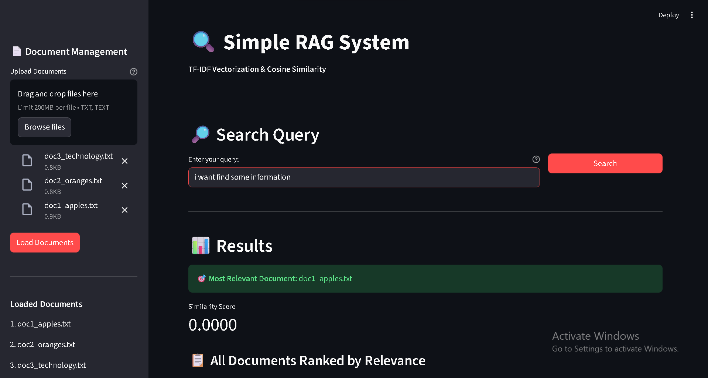
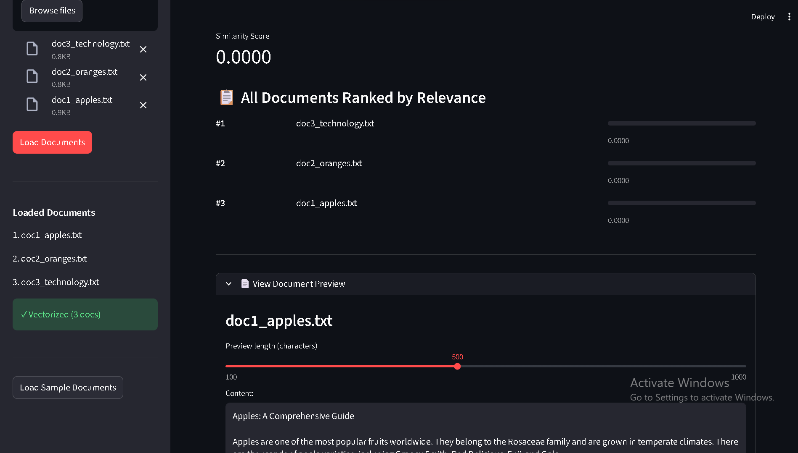

# Simple RAG System

A Python application that implements a simple Retrieval-Augmented Generation (RAG) system using TF-IDF vectorization and cosine similarity to find the most relevant document based on user queries.

## Features

- 📄 **Document Upload**: Load multiple text documents
- 🔢 **TF-IDF Vectorization**: Convert documents to vectors using Term Frequency-Inverse Document Frequency
- 🔍 **Query Search**: Enter natural language queries to find relevant documents
- 📊 **Cosine Similarity**: Calculate similarity between query and documents
- 🎯 **Ranked Results**: Display all documents ranked by relevance
- 👁️ **Document Preview**: View previews of the most relevant documents

## How It Works

1. **Document Loading**: The system asks users to provide paths to text documents
2. **Vectorization**: Each document is converted to a TF-IDF vector representation
3. **Query Processing**: User queries are converted to vectors using the same TF-IDF model
4. **Similarity Calculation**: Cosine similarity is computed between the query vector and all document vectors
5. **Result Ranking**: Documents are ranked by similarity score, and the most relevant document is returned

## Installation

1. Install required dependencies:

```bash
pip install -r requirements.txt
```

## Screenshots

### Streamlit Web Interface


_Main interface with document upload and search functionality_


_Search results showing ranked documents with similarity scores_

## Usage

### Option 1: Streamlit Web Interface (Recommended)

1. Run the Streamlit app:

```bash
streamlit run app.py
```

2. Use the web interface:
   - Upload documents using the sidebar file uploader
   - Or click "Load Sample Documents" to use the example files
   - Enter your search query in the text box
   - View ranked results with similarity scores

### Option 2: Command Line Interface

1. Run the CLI application:

```bash
python simple_rag.py
```

2. Follow the prompts:
   - Enter paths to your text documents (one per line)
   - Type 'done' when finished adding documents
   - Enter your search query
   - View the most relevant document and similarity scores

## Example

```
Enter document path (or 'done'): sample_documents/doc1_apples.txt
✓ Loaded: doc1_apples.txt

Enter document path (or 'done'): sample_documents/doc2_oranges.txt
✓ Loaded: doc2_oranges.txt

Enter document path (or 'done'): done

Your query: I want to find information on Apples

🎯 Most Relevant Document: doc1_apples.txt
📊 Similarity Score: 0.5234
```

## Sample Documents

The `sample_documents/` folder contains example text files you can use to test the system:

- `doc1_apples.txt` - Information about apples
- `doc2_oranges.txt` - Information about oranges
- `doc3_technology.txt` - Information about technology

## Technical Details

- **TF-IDF**: Measures word importance by considering term frequency in a document and inverse document frequency across all documents
- **Cosine Similarity**: Measures the cosine of the angle between two vectors, ranging from 0 (completely dissimilar) to 1 (identical)
- **No External LLM**: This system relies purely on mathematical vector operations, not language models

## Requirements

- Python 3.7+
- numpy
- scikit-learn
- streamlit

